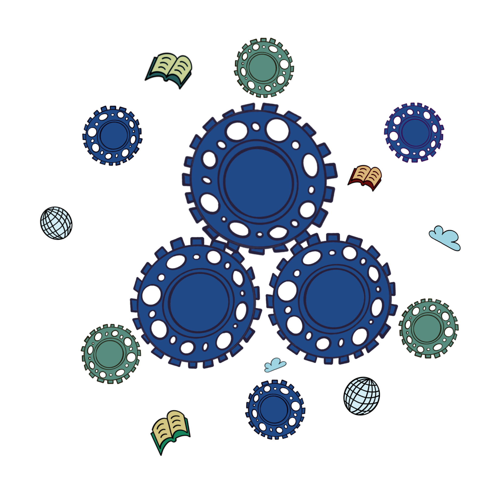

<p align="center">
  
</p>

# Zopedia

> A personal wiki that grows with you. Drop in sources, ask questions, and let the LLM build a structured, interlinked knowledge base that compounds over time.

Inspired by [Karpathy's vision for LLM-powered wikis](https://gist.github.com/karpathy/442a6bf555914893e9891c11519de94f) — the key insight is that LLMs don't get bored, don't forget cross-references, and can maintain dozens of pages in one pass. Zopedia automates the maintenance so you focus on asking questions and curating.

---

## Table of Contents

- [How It Works](#how-it-works)
- [Quick Start](#quick-start)
- [Features](#features)
- [Architecture](#architecture)
- [Environment Variables](#environment-variables)
- [API](#api)
- [Development](#development)

---

## How It Works

```
Drop files → raw/  →  Watcher detects  →  LLM extracts entities, concepts, summaries
                                          ↓
                                    wiki_data/wiki/
                                    ├── entities/     (people, orgs, products)
                                    ├── concepts/     (ideas, themes, topics)
                                    ├── analysis/     (query answers, filed back)
                                    ├── sources/      (summaries of ingested files)
                                    ├── godnodes/     (community clusters)
                                    ├── index.md       (full catalog)
                                    ├── index-concise.md (flat entity/concept list)
                                    └── index-godnodes.md (community-based TOC)

Ask questions  →  Model reads index  →  Picks relevant community  →  Reads pages
                                       →  Follows [[wikilinks]]   →  Synthesizes answer
```

### Three-Layer Design

| Layer | What | Who owns it |
|---|---|---|
| **Raw sources** | Original files in `raw/` — immutable | You |
| **The wiki** | LLM-generated markdown pages — entities, concepts, analysis, summaries | LLM |
| **The schema** | Config (env vars, system prompt) — tells the LLM wiki conventions | You + LLM |

### Three Operations

1. **Ingest** — Drop a PDF or text file into `raw/`. The LLM reads it, extracts entities and concepts, writes summary pages, updates cross-references, rebuilds the index.
2. **Query** — Chat with your knowledge base. The model reads the community index, expands relevant clusters, follows wikilinks to analysis pages, and synthesizes answers with citations.
3. **Maintain** — Periodic lint finds orphans, stale pages, broken links, and missing concepts. Enrichment adds cross-references. Compaction rewrites bloated pages. Merge deduplicates. All automated.

---

## Quick Start

```bash
# Clone and install
git clone https://github.com/zohairshafi/zopedia.git
cd zopedia
cd backend && pip install -r requirements.txt
cd ../frontend && npm install && npm run build

# Configure (DeepSeek, OpenAI, or any compatible API)
export ZOPEDIA_LLM_BASE_URL=https://api.deepseek.com/v1
export ZOPEDIA_LLM_API_KEY=sk-your-key
export ZOPEDIA_LLM_MODEL=deepseek-v4-flash 

# Run
cd ../backend && python main.py
# Open http://localhost:8000
```

Drop files into `backend/wiki_data/raw/` or use the **Upload Files** button in the sidebar under Wiki Options.

---

## Providers & Local LLMs

Zopedia speaks the **OpenAI-compatible API protocol** (`/chat/completions`, standard messages, standard tool definitions). It works with any provider that implements this format:

| Provider | Works? | Notes |
|---|---|---|
| **DeepSeek** | Native | Full CoT reasoning visibility via `reasoning_content` |
| **OpenAI** | Yes | Standard chat completions, tool calling |
| **Ollama** | Yes | Run fully local. Start with `ollama serve`, point `ZOPEDIA_LLM_BASE_URL` at `http://localhost:11434/v1` |
| **llama.cpp** | Yes | Run fully local. Use its built-in `/v1/chat/completions` endpoint |
| **vLLM / LiteLLM** | Yes | Any OpenAI-compatible proxy |
| **Anthropic** | No (direct) | Different API format. Use LiteLLM as a proxy to translate |

### Fully Local Setup

```bash
# Terminal 1: Start Ollama with a tool-calling-capable model
ollama pull qwen3:14b    # or llama3.1, mistral, etc.
ollama serve

# Terminal 2: Point Zopedia at your local Ollama
export ZOPEDIA_LLM_BASE_URL=http://localhost:11434/v1
export ZOPEDIA_LLM_API_KEY=ollama     # Ollama ignores the key but requires one
export ZOPEDIA_LLM_MODEL=qwen3:14b

cd backend && python main.py
# Everything runs on your machine — no data leaves
```

> **Note**: Tool calling requires a model that supports it. Look for models with tool-calling / function-calling support (Qwen 3, Llama 3.1+, Mistral 3, Command R+, etc.). Smaller models (<7B) may struggle with complex multi-turn tool use.

---

## API-First / Headless Usage

Zopedia exposes an OpenAI-compatible chat endpoint. You don't need the UI — embed it into any application that can make HTTP requests:

```bash
curl http://127.0.0.1:8000/v1/chat/completions \
  -H "Authorization: Bearer sk-zopedia-YOUR_KEY" \
  -H "Content-Type: application/json" \
  -d '{
    "messages": [{"role": "user", "content": "What do we know about Zopedia?"}],
    "stream": true
  }'
```

The model automatically reads your wiki, follows cross-references, and synthesizes answers — no UI required. Use it as a:

- **Research assistant**: Point `ZOPEDIA_WIKI_VAULT/raw` at your Zotero library folder. Every paper you add gets ingested, analyzed, and cross-referenced. Your literature review maintains itself.
- **Company knowledge base**: Drop meeting notes, design docs, and post-mortems into `raw/`. The wiki connects people, projects, and decisions.
- **Personal second brain**: Journal entries, book notes, article clippings — everything interlinked, searchable by conversation.
- **Embedded agent**: Call `/v1/chat/completions` from your own app, CLI tool, or automation pipeline. The wiki is the memory.

---

## Features

### Wiki Intelligence

- **Automatic extraction**: Entities, concepts, summaries, and contradictions are extracted from every ingested file
- **Structured pages**: Each entity/concept has Summary, Facts, Contradictions, Sources, and Referenced by Analyses sections
- **Cross-referencing**: `[[wikilinks]]` connect entities → concepts → analysis → sources, forming a navigable knowledge graph
- **Incremental updates**: Entity/concept pages accumulate timestamped updates as new sources arrive. When updates exceed the limit, the LLM rewrites the entire page, merging all knowledge into a clean, current version

### Smart Retrieval

- **Tool-calling RAG**: The model uses `read_wiki_page` and `web_search` tools — no chunk-and-embed, no lexical search, no vector embedding and vector DB 
- **Community-based index**: Pages are clustered via bipartite graph projection + greedy modularity community detection. The index stays compact regardless of wiki size (one line per community)
- **Hierarchical navigation**: Model scans community TOC → expands relevant cluster → reads individual pages → follows `[[wikilinks]]` to analysis pages
- **Web search fallback**: When the wiki doesn't have the answer, the model can search DuckDuckGo

### Automated Maintenance (every N ingests)

| Step | What it does | LLM calls |
|---|---|---|
| **Lint** | Finds orphans, stale pages, broken links, missing concepts, merge candidates | 0 |
| **Fallback retry** | Re-queries analyses that used extractive fallback | 1 per page |
| **Enrichment** | Adds cross-reference links to analysis pages, refreshes oldest pages, fills concept gaps from web | 1 per group per page |
| **Backlinks** | Updates "Referenced by Analyses" sections on entity/concept pages | 0 |
| **God-nodes rebuild** | Re-clusters wiki pages into communities, regenerates community index | 1 per community |
| **Compaction** | Rewrites entity/concept pages that have too many incremental updates | 1 per page |
| **Merge** | Finds and merges near-duplicate entity/concept pages | 1 per candidate pair |

All triggered automatically by the file watcher or manually via sidebar buttons.

### User Interface

- **Chat composer** with web search toggle, reasoning controls, and dictation support
- **Knowledge graph visualization** — browse entities, concepts, analysis, and sources in an interactive graph
- **Wiki Behaviour panel** — view and edit all 20+ configuration variables from the UI
- **Upload dialog** — drag-and-drop files directly into the wiki raw/ folder
- **Sidebar controls**: Run Lint, Refresh Index, Run Maintenance (with/without web fill), View/Edit Wiki Data, Upload Files

---

## Architecture

```
zopedia/
├── backend/
│   ├── main.py              # FastAPI app, lifespan, upload, health, shutdown
│   ├── requirements.txt     # Python deps
│   ├── core/
│   │   ├── llm.py           # Upstream API client, tool definitions, web search
│   │   └── wiki/
│   │       ├── engine.py    # Wiki engine (~10k lines): extraction, enrichment,
│   │       │                  merge, compaction, community detection, indexing
│   │       ├── manager.py   # Thin facade over engine
│   │       ├── ingestor.py  # File ingestion (PDF via PyMuPDF, text)
│   │       ├── watcher.py   # File system watcher + maintenance lifecycle
│   │       ├── runtime_env.py  # 20+ env var definitions with validation
│   │       └── bridge.py    # ZOPEDIA_* → UNSLOTH_* env mapping
│   ├── routes/
│   │   ├── chat.py          # /v1/chat/completions — tool-calling + streaming
│   │   └── wiki.py          # Wiki management endpoints (17 endpoints)
│   ├── models/wiki.py       # Pydantic models
│   └── auth/                # JWT auth (disabled by default, single-user mode)
├── frontend/                # React + Vite + TypeScript (assistant-ui)
├── graphify/                # Graph analysis library (minimal — 7 files)
├── notebooks/               # Jupyter notebooks for graph exploration
└── docs/                    # Architecture, multi-user plan, etc.
```

See [ARCHITECTURE.md](ARCHITECTURE.md) for full prompt table, maintenance lifecycle diagrams, and god-nodes index pagination design.

---

## Environment Variables

### Required
| Variable | Default | Description |
|---|---|---|
| `ZOPEDIA_LLM_BASE_URL` | — | Upstream API endpoint (OpenAI-compatible) |
| `ZOPEDIA_LLM_API_KEY` | — | API key |
| `ZOPEDIA_LLM_MODEL` | — | Model name (e.g. `deepseek-chat`) |

### Wiki & Chat
| Variable | Default | Description |
|---|---|---|
| `ZOPEDIA_WIKI_VAULT` | `./wiki_data` | Root wiki vault directory |
| `ZOPEDIA_WIKI_WATCHER` | `true` | Background file watcher for `raw/` |
| `ZOPEDIA_WIKI_AUTO_QUERY_ON_INGEST` | `true` | Auto-generate analysis after ingestion |
| `ZOPEDIA_WIKI_TOOL_RETRIEVAL` | `true` | Tool-calling mode (disable for legacy RAG) |
| `ZOPEDIA_WIKI_MAX_TOOL_TURNS` | `8` | Max tool-calling turns per chat request |
| `ZOPEDIA_WIKI_MAX_READS_PER_TURN` | `20` | Max wiki reads per turn |
| `ZOPEDIA_WIKI_LLM_MAX_TOKENS` | `6000` | Max tokens for wiki-generated responses |

### Index & Communities
| Variable | Default | Description |
|---|---|---|
| `ZOPEDIA_WIKI_COMMUNITY_CUTOFF` | `20` | Max number of communities detected (higher = more fine-grained clusters) |
| `ZOPEDIA_WIKI_COMMUNITY_MIN_SIZE` | `4` | Communities smaller than this merge into Other Pages |

### Ingestion
| Variable | Default | Description |
|---|---|---|
| `ZOPEDIA_WIKI_PENDING_INGEST_INTERVAL_SECONDS` | `45` | Min seconds between ingest sweeps during chat |
| `ZOPEDIA_WIKI_PENDING_INGEST_MAX_FILES_PER_CHAT` | `1` | Max files ingested per chat request (0=off) |

### Maintenance
| Variable | Default | Description |
|---|---|---|
| `ZOPEDIA_WIKI_MAX_ANALYSIS_PAGES` | `64` | Max analysis pages per enrich/retry/backlinks run |
| `ZOPEDIA_WIKI_AUTO_LINT_EVERY` | `10` | Run maintenance every N ingests (0=off) |
| `ZOPEDIA_WIKI_AUTO_RETRY_FALLBACK_ANALYSES_MAX_PAGES` | `24` | Max fallback retry pages per run (0=off) |
| `ZOPEDIA_WIKI_MERGE_MAINTENANCE_MAX_MERGES` | `512` | Max entity/concept merges per run |
| `ZOPEDIA_WIKI_KNOWLEDGE_MAX_INCREMENTAL_UPDATES` | `10` | Max incremental update blocks before LLM rewrite |
| `ZOPEDIA_WIKI_COMPACTION_MAX_PAGES` | `64` | Max pages LLM-rewritten per run (0=off) |

### Other
| Variable | Default | Description |
|---|---|---|
| `ZOPEDIA_LLM_TIMEOUT_SECONDS` | `300` | Timeout for upstream API calls |
| `ZOPEDIA_AUTH_DISABLED` | `true` | Skip authentication (single-user mode) |
| `ZOPEDIA_PORT` | `8000` | Server port |

---

## API

### Chat
```
POST /v1/chat/completions    OpenAI-compatible chat with tool-calling + streaming
```

### Wiki Management
```
GET    /api/inference/wiki/env              List all config variables
POST   /api/inference/wiki/env              Update config variables
GET    /api/inference/wiki/lint             Run health scan
POST   /api/inference/wiki/retry-fallback   Re-query fallback analyses
POST   /api/inference/wiki/enrich           Run enrichment pipeline
POST   /api/inference/wiki/analysis-backlinks  Refresh backlink sections
POST   /api/inference/wiki/rebuild-index    Backlinks + god-nodes index rebuild
POST   /api/inference/wiki/merge-maintenance   Merge duplicate pages
POST   /api/inference/wiki/chat-history/save   Save chat to wiki raw/
GET    /api/inference/wiki/data-graph       Get knowledge graph data
POST   /api/inference/wiki/delete-entries   Delete wiki entries
```

### Other
```
POST /api/upload             Upload files to raw/ folder
GET  /api/health             Server health check
POST /api/shutdown           Shut down the server
```

---

## Development

```bash
# Backend
cd backend
pip install -r requirements.txt
python main.py              # Starts on port 8000

# Frontend (dev mode with hot reload)
cd frontend
npm install
npm run dev                 # Starts Vite dev server

# Build for production
npm run build               # Output to frontend/dist/
```

### Key Dependencies

- **Backend**: FastAPI, Uvicorn, httpx, networkx, PyMuPDF (PDF ingestion), ddgs (web search), watchdog
- **Frontend**: React 19, Vite, TypeScript, assistant-ui, Tailwind CSS, shadcn/ui, Dexie (IndexedDB)
- **Graph analysis**: NetworkX for community detection, graphify for code-aware ingestion

---

Built on the idea that your knowledge base should compound — every question answered, every source ingested, every cross-reference added makes the next question better.

---

## License & Attribution

Zopedia is built on top of [Unsloth Studio](https://github.com/unslothai/unsloth), an open-source platform for local LLM fine-tuning and chat. Unsloth Studio is licensed under AGPL-3.0, and Zopedia retains the same license. The core wiki engine, graphify library, ingestion pipeline, and frontend UI framework were adapted from Unsloth Studio — with training, model serving, and fine-tuning features removed, and community-based index pagination, maintenance lifecycle improvements, and an upstream-API-only chat flow added on top.
